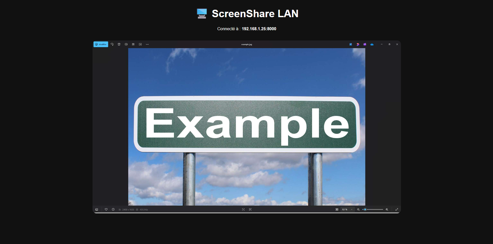

# 🖥️ ScreenShare LAN


A simple and lightweight **open source LAN screen sharing application**.

Share your computer screen instantly on your local network using only a web browser.  
No client installation required.


## ✨ Features

✅ Real-time screen sharing  
✅ Works on local network (LAN)  
✅ No software required on viewer devices  
✅ Browser-based access  
✅ WebSocket streaming  
✅ Multiple viewers support  
✅ Automatic local IP detection  
✅ Lightweight and fast  


## 📸 Screenshot




## 🎯 Why ScreenShare LAN?

Most screen sharing solutions require:
- Account creation
- Cloud services
- Installing applications
- Internet connection

ScreenShare LAN is designed to be:

- 🔒 Private (your screen stays on your network)
- ⚡ Fast
- 🖥️ Simple
- 🆓 Free and open source


# 🚀 Installation


## Requirements

- Python 3.10+
- Windows / Linux / macOS
- Devices connected to the same network


## Clone the repository

```bash
git clone https://github.com/YRYTED/ScreenShare-LAN.git

cd ScreenShare-LAN
```


## Install dependencies

```bash
pip install -r requirements.txt
```


## Start the server

```bash
uvicorn app:app --host 0.0.0.0 --port 8000
```


The application will start:

```
http://0.0.0.0:8000
```


## Connect from another device

Find your computer IP address:

Example:

```
192.168.1.50
```

Open this URL on another device:

```
http://192.168.1.50:8000
```


# 🛠️ Technologies

## Backend

- Python
- FastAPI
- Uvicorn
- WebSockets
- MSS
- OpenCV


## Frontend

- HTML
- CSS
- JavaScript


# 📂 Project Structure

```
ScreenShare-LAN/

│
├── app.py              # FastAPI server
├── capture.py          # Screen capture system
├── requirements.txt    # Dependencies
│
├── templates/
│   └── index.html      # Web interface
│
└── static/
    ├── style.css       # Interface style
    └── script.js       # WebSocket client
```


# ⚙️ How it works

```
Computer

   ↓

Screen Capture (MSS)

   ↓

JPEG Compression

   ↓

WebSocket Server

   ↓

Browser Client
```


The application captures your screen, compresses frames, and sends them in real time through a WebSocket connection.


# 🗺️ Roadmap

## Version 1.0 ✅

- [x] Basic screen streaming
- [x] Web browser viewer
- [x] LAN support
- [x] FastAPI backend


## Version 1.1 🚧

- [ ] Better image quality
- [ ] FPS counter
- [ ] Connected users counter
- [ ] QR Code connection
- [ ] Quality settings


## Version 2.0 🔮

- [ ] WebRTC streaming
- [ ] Audio sharing
- [ ] Multiple monitor support
- [ ] Password protection
- [ ] Hardware encoding
- [ ] Lower latency


## Version 3.0 🚀

- [ ] Windows executable
- [ ] Linux support
- [ ] Mobile optimized interface
- [ ] Remote control mode


# 🤝 Contributing

Contributions are welcome!

Steps:

1. Fork the repository
2. Create a new branch

```bash
git checkout -b feature-name
```

3. Make your changes
4. Commit

```bash
git commit -m "Add new feature"
```

5. Push your branch
6. Create a Pull Request


# 🐛 Bug Reports

If you find a bug, please create an issue with:

- Operating system
- Python version
- Error message
- Steps to reproduce


# 🔐 Privacy

ScreenShare LAN does not use any external server.

Your screen data stays inside your local network.


# 📜 License

This project is licensed under the MIT License.

You are free to use, modify and distribute this software.


# ⭐ Support

If you like this project:

- Give it a ⭐ on GitHub
- Share it with others
- Contribute improvements


---

Made with ❤️ using Python and FastAPI
